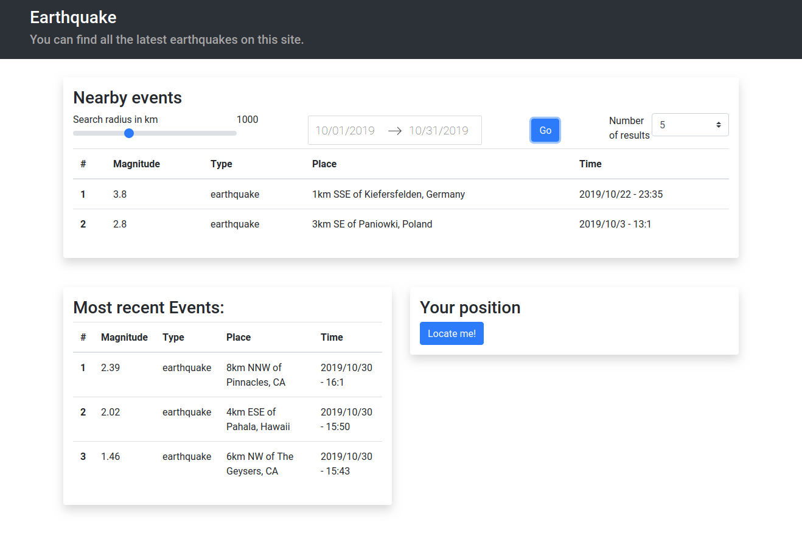

# earthquake-challenge
The task of this challenge was to use the earthquake data API provided by https://earthquake.usgs.gov in a creative way. I built a small web app which you can use to see the most recent events and find the ones closest to you based on your location.

If you want to run the project please go one directory deeper and look at the [README](./earthquake/README.md) there.

### Screenshots
